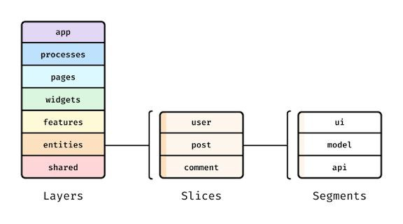
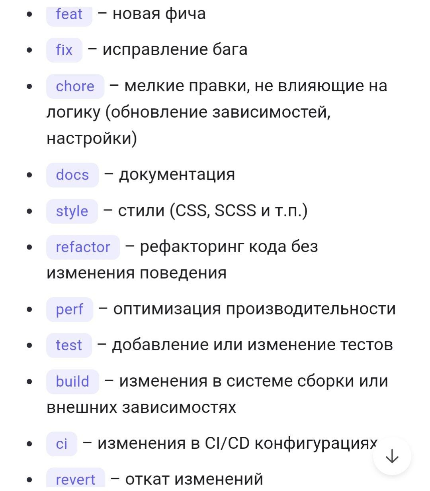

## Стайлгайд проекта

#### 1.Обязательное соблюдение структуры и правил импортов FSD
##### https://feature-sliced.design/docs/get-started/tutorial

#### 2.Название scss класса должно совпадать с названием компонента
##### Пример:
BigButton.tsx - 

##### Пример модификаций:

#### 4.Компоненты экспортируются через именной экспорт (кроме случаев page.tsx и иных сущностей, где обязателен default экспорт)
##### Пример:
import { FC } from 'react';

import styles from './next.config.module.scss';

interface next.configProps {

}

export const next.config: FC<next.configProps> = ({ }) => {
    return (
        

            next.config
        

    );
};

#### 5.Следить за 'use client' и делать дочерние компоненты не 'use client', если они требуют SSR/SSG/ISR (достигается с помощью прокидки через children)

#### 6.Если компонент требует разных пропсов в зависимости от размера экрана, использовать <Media /> компонент, а не useEffect во избежание дерганья макета

#### 7.При создании компонента, обязательно экспортировать его из index.ts и также импортировать от туда

#### 8.Название веток формируются из типа задачи и её номера. 
##### Пример: 
Тип: Задача
Название: TFIL-1

Название ветки будет feature/TFIL-1

Тип: Bug
Название: TFIL-1

Название ветки будет fix/TFIL-1

#### 9.Название коммитов формируются следующим образом: \<type\>(\<scope\> - необязательно): \<subject\>
##### Пример:
feat: add button

fix(button): delete extra imports

##### Таблица названий (\<type\>)

